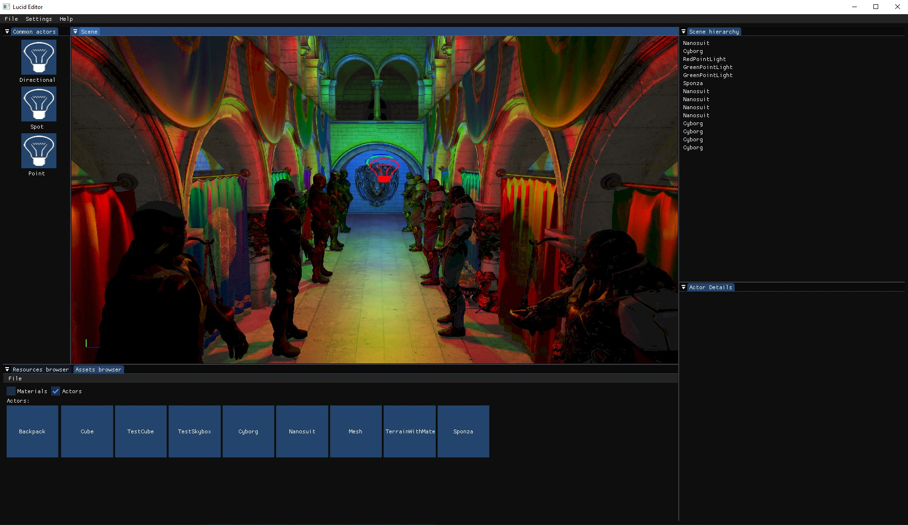
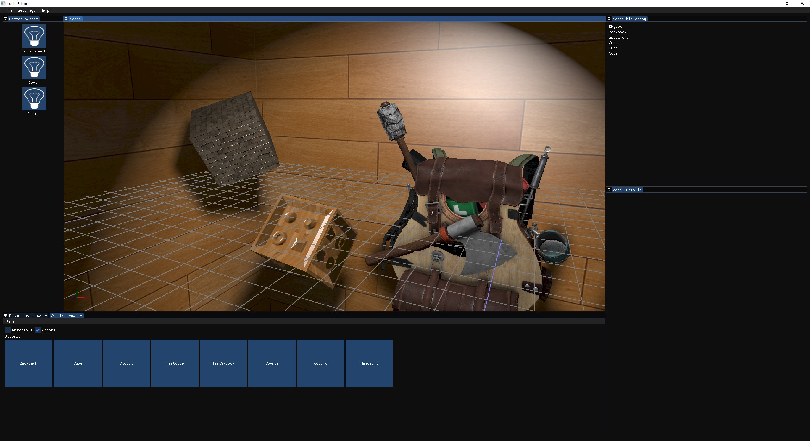

## Lucid
This project is my current attempt to create a 3D renderer. It's not meant to be a generic 3D game engine, but more of sandbox for me to practice my CG skills.
This doesn't mean that one day I won't try to make it into a small in-house engine, but currently it's a 3D renderer + a basic editor.


I don't guarantee that it'll run on every platform and on every GPU, as that's not my goal with this project.


### What can it do:
- resource import
- basic scene management
- basic asset handling
- static meshes
- directional, spot, point light
- dynamic shadows
- SSAO
- depth pre-pass
- mesh batching (using bindless textures + SSBOs)
- some editor primitives (debug lines, world grid, billboards)
- simple shading using blinn phong materials
- skybox

### Whats is left to do:
- culling
- PBR
- shadow maps cashing
- some VFXs
- skeletal meshes
- reflections
- baking lightmaps
- ...
  
Don't event get me started.

Given all that I'm pretty happy with how it's going, as this attempt is looking pretty promising after all the stuff I've put into the trash.


### Generate project files using premake

There is a `premake` file that you can use to generate project/make files in the following manner 
```
premake5 vs2017
```

### Some screen shots




